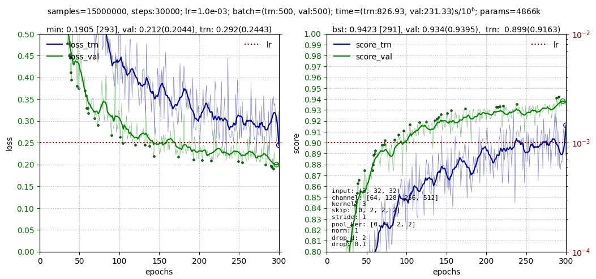
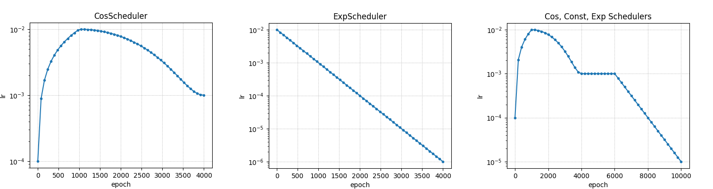
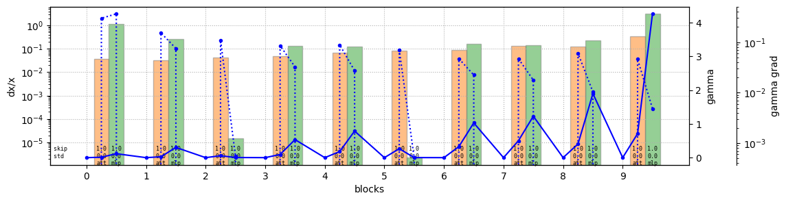

# QuNet

[](https://www.python.org/downloads/release/python-370/)
[](https://badge.fury.io/py/torchinfo)


Easy working with deep learning models.
* Trainer class for training the model.
* Various tools for visualizing the training process and the state of the model.
* Training large models: float16, mini-batch splitting, etc.
* Large set of custom modules for neural networks (MLP, CNN, Transformer, etc.)

<hr>

## Install

```
pip install qunet
```
<hr>

## Usage

To work with the library, it is enough to add `training_step(batch, batch_id)` to the model, in which to calculate the loss and, if necessary, some quality metrics.
For example, for 1D linear regression  $y=f(x)$ with mse-loss and metric as |y_pred-y_true|, model looks like:
```python
class Model(nn.Module):
    def __init__(self):              
        super().__init__() 
        self.fc = nn.Linear( 1, 1 )

    def forward(self, x):                                 # (B,1)
        return self.fc(x)                                 # (B,1)

    def training_step(self, batch, batch_id):        
        x, y_true = batch                                 # the model knows the minbatch format
        y_pred = self(x)                                  # (B,1)  forward function call

        loss  = (y_pred - y_true).pow(2).mean()           # ()     loss for optimization (scalar)!
        error = torch.abs(y_pred.detach()-y_true).mean()  # (B,1)  error for batch samples

        return {'loss':loss, 'score': error}              # if no score, you can return loss

model = Model()        
```

Training and validation datasets can be standard `DataLoader`.
For small datasets, you can also use the faster loader  `Data` from the library:

```python
from qunet import Data, Trainer

num, val = 1000, 900
X = torch.rand(num)
Y = 2*X + torch.randn(X.shape)

data_trn = Data( (X[:val], Y[:val]) )
data_val = Data( (X[val:], Y[val:]) )
```

After that, we create an instance of the trainer, pass the model and data to it.
Set the optimizer at the trainer and start training:

```python                                             
trainer = Trainer(model, data_trn, data_val)
trainer.set_optimizer( torch.optim.SGD(model.parameters(), lr=1e-2) )
trainer.fit(epochs=10, period_plot=5, monitor=['loss'])
```

This is all!

Let's make a small overview of the library.
A more detailed introduction can be found in the document [Quick start](doc/intro.md), documents describing the various modules of the library, and notebooks dedicated to various deep learning tasks.
<hr>

## Trainer

The trainer is a key object of the QuNet library. It solves the following tasks:
* Model training and validation.
* Visualization of the learning process, with ample opportunities for its customization.
* Calculation of optimal breakpoints based on the best local and smoothed metrics.
* Saving the best models by loss or score, as well as saving checkpoints.
* Combine different training schedulers
* For large models, switch to half precision and use the gradient accumulation buffer.
* Use of multiple callback objects that can be embedded in different parts of the pipeline.

Below is an example of visualization:

<center>

</center>

```
val_loss:  best = 0.190465[293], smooth21 = 0.199713[296], last21 = 0.210965 ± 0.019436
trn_loss:  best = 0.209042[234], smooth21 = 0.244457[299], last21 = 0.293281 ± 0.043728

val_score: best = 0.942300[291], smooth21 = 0.938188[295], last21 = 0.934581 ± 0.000000
trn_score: best = 0.929560[234], smooth21 = 0.916017[299], last21 = 0.898531 ± 0.005823

epochs=300, samples=15000000, steps=30000
times=(trn:214.34, val:11.69)m,  42.87 s/epoch, 428.68 s/10^3 steps,  857.35 s/10^6 samples
```

Example of learning curves of various [schedulers](doc/schedules.md):

<center>

</center>


<hr>

## ModelState

The standalone `ModelState` class is a powerful replacement for libraries such as torchinfo.
It allows you to display information about submodules and their parameters.
```
Transformer                            params           data
├─ ModuleList                                                           ->                 <  blocks
│  └─ TransformerBlock                                   (1, 10, 64)    -> (1, 10, 64)     <  blocks[0]
│     └─ Residual                                        (1, 10, 64)    -> (1, 10, 64)     <  blocks[0].fft
│        └─ FFT                                          (1, 10, 64)    -> (1, 10, 64)     <  blocks[0].fft.module
│           └─ Dropout(0)                                (1, 10, 64)    -> (1, 10, 64)     <  blocks[0].fft.module.drop        
│        └─ LayerNorm                     128         |  (1, 10, 64)    -> (1, 10, 64)     <  blocks[0].fft.norm
│     └─ Residual                                        (1, 10, 64)    -> (1, 10, 64)     <  blocks[0].att
│        └─ Attention                                    (1, 10, 64)    -> (1, 10, 64)     <  blocks[0].att.module
│           └─ Linear(64->192)         12,480  ~  25% |  (1, 10, 64)    -> (1, 10, 192)    <  blocks[0].att.module.c_attn      
│           └─ Linear(64->64)           4,160  ~   8% |  (1, 10, 64)    -> (1, 10, 64)     <  blocks[0].att.module.c_proj      
│           └─ Dropout(0)                                (1, 4, 10, 10) -> (1, 4, 10, 10)  <  blocks[0].att.module.att_dropout 
│           └─ Dropout(0)                                (1, 10, 64)    -> (1, 10, 64)     <  blocks[0].att.module.res_dropout 
│        └─ LayerNorm                     128         |  (1, 10, 64)    -> (1, 10, 64)     <  blocks[0].att.norm
│     └─ Residual                                        (1, 10, 64)    -> (1, 10, 64)     <  blocks[0].mlp
│        └─ MLP                                          (1, 10, 64)    -> (1, 10, 64)     <  blocks[0].mlp.module
│           └─ Sequential                                (1, 10, 64)    -> (1, 10, 64)     <  blocks[0].mlp.module.layers      
│              └─ Linear(64->256)      16,640  ~  33% |  (1, 10, 64)    -> (1, 10, 256)    <  blocks[0].mlp.module.layers[0]   
│              └─ GELU                                   (1, 10, 256)   -> (1, 10, 256)    <  blocks[0].mlp.module.layers[1]   
│              └─ Dropout(0)                             (1, 10, 256)   -> (1, 10, 256)    <  blocks[0].mlp.module.layers[2]   
│              └─ Linear(256->64)      16,448  ~  33% |  (1, 10, 256)   -> (1, 10, 64)     <  blocks[0].mlp.module.layers[3]   
│        └─ LayerNorm                     128         |  (1, 10, 64)    -> (1, 10, 64)     <  blocks[0].mlp.norm
=============================================
trainable:                             50,115
```

During training, `ModelState` keeps track of gradients and smoothes values:
```
 #                                           params          |mean|  [     min,      max ]  |grad|   shape
-------------------------------------------------------------------------------------
  0: blocks.0.fft.gamma                            1           0.200  [   0.200,    0.200]   1.3e+02  ()
  1: blocks.0.fft.norm.weight                     64           1.000  [   1.000,    1.000]   4.7e-01  (64,)
  2: blocks.0.fft.norm.bias                       64           0.000  [   0.000,    0.000]   2.2e-01  (64,)
  ...
```


<hr>

## Modules

The library has many ready-made modules for building various architectures of neural networks:

* MLP
* Transformer
* CNN
* ResCNN
* ProjViT
* ResCNN3D
* GNN

Most modules have debugging and visualization tools.
For example, this is how the visualization of the learning process of a transformer, consisting of 10 blocks, looks like.

<center>

</center>


Such diagrams allow you to analyze the problem areas of the network and change them in the learning process.
<hr>


## Docs

<hr>

## Examples

* <a href="https://colab.research.google.com/drive/179sHb3WyHNrSJKGLfKrXaAzvShmS1SSf?usp=sharing">Interpolation_F(x)</a> - interpolation of a function of one variable (example of setting up a training plot; working with the list of schedulers; adding a custom plot)
* <a href="https://colab.research.google.com/drive/1N4b6mwUvH-o-t6VIiuhq7FMuGRabdOm0?usp=sharing">MNIST</a> - recognition of handwritten digits 0-9 (example using pytorch DataLoader, model predict, show errors, confusion matrix)
* <a href="https://colab.research.google.com/drive/1ThxnMrAjuFTGKXLI-93oRa9doNpP32y4?usp=sharing">CIFAR10</a>  (truncated EfficientNet, pre-trained parameters, bone freezing, augmentation)
* Vanishing gradient
* Regression_1D - visualization of changes in model parameters

