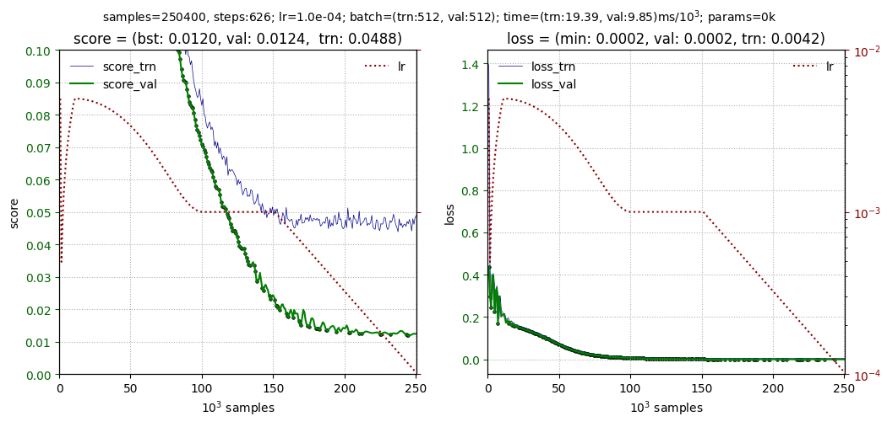

# QuNet

[](https://www.python.org/downloads/release/python-370/)
[](https://badge.fury.io/py/torchinfo)


Easy working with deep learning models.
* Large set of custom modules for neural networks (MLP, CNN, Transformer, etc.)
* Trainer class for training the model.
* Various tools for visualizing the training process and the state of the model.
* Training large models: float16, mini-batch splitting, etc.

<hr>

## Install

```
pip install qunet
```
<hr>

## Usage

```python
from qunet import Data, Trainer, Scheduler_Exp
                                             
trainer = Trainer(model, data_trn, data_val)

trainer.set_optimizer( torch.optim.SGD(model.parameters(), lr=1e-2) )
trainer.set_scheduler( Scheduler_Exp(lr1=1e-5, lr2=1e-4, samples=100e3) )

trainer.view.loss(y_min=0, y_max=0.5)
trainer.fit(epochs=10, period_plot=5, monitor=['loss'])
```

<hr>

## Model

Model must be a class (successor of nn.Module) with functions:

* `forward(x)` function takes input `x` and returns output `y`. 
This function is not used directly by the coach and usually contains the complete logic of the model.
* `training_step(batch, batch_id)` - called by the trainer during the training phase. 
Should return a scalar loss (with computational graph).
It can also return a dictionary like `{"loss": loss, "score": torch.hstack([accuracy, tnr, tpr])}`, where score is a quality metrics.
* `validation_step(batch, batch_id)` - similarly called at the model validation stage.
If it does the same calculations as `training_step`, it can be omitted.
* `predict_step(batch, batch_id)` - required when using the `predict` method. Should return a tensor `y_pred` of the model's output (or a dictionary `{"output": y_pred, "score": metrics}`, where `metrics` are any quality metrics tensor for each example).

For example, for 1D linear regression  $y=f(x)$ with mse-loss and metric as |y_pred-y_true|, model looks like:
```python
class Model(nn.Module):
    def __init__(self):              
        super().__init__() 
        self.fc = nn.Linear( 1, 1 )

    def forward(self, x):                                 # (B,1)
        return self.fc(x)                                 # (B,1)

    def training_step(self, batch, batch_id):        
        x, y_true = batch                                 # the model knows the minbatch format
        y_pred = self(x)                                  # (B,1)  forward function call
        loss  = (y_pred - y_true).pow(2).mean()           # ()     loss for optimization (scalar)!
        error = torch.abs(y_pred.detach()-y_true).mean()  # (B,1)  error for batch samples
        return {'loss':loss, 'score': error}              # if no score, you can return loss
```
As we can see, the model description interface is the same as the library interface <a href="https://lightning.ai/">PyTorch Lightning</a>

<hr>

## Data

QuNet has a Data class - data for model training or validation. It can be overridden or pytorch DataLoader can be used.
The iterator `__next__`  is supposed  must return an mini-batch, has the same structure as passed `dataset` when creating the `Data`.
For example, let's create training data in which two tensors X1,X2 are the input of the model and one tensor Y is the output (target):
```python    
from qunet import Data

X1, X2 = torch.rand(1000,3), torch.rand(1000,3,20)
Y = X1 * torch.sigmoid(X2).mean(-1)

data_trn = Data( dataset=( (X1,X2), Y ), batch_size=100)  
 
for (x1,x2), y in data_trn:
    print(x1.shape, x2.shape, y.shape)  # (100,3) (100,3,20) (100,3)
```        
All tensors in the dataset are assumed to have the same length (by first index).
The model is responsible for interpreting the composition of the mini-batch.

The Data class constructor has the following parameters:
```python
Data(dataset, shuffle=True, batch_size=64,  whole_batch=False, n_packs=1)
```
* `dataset` - model training data: tensor X or tuple input and output tensors: (X, Y), and etc.
* `shuffle` - shuffle data after after passing through all examples
* `batch_size` - minibatch size; can be changed later: data_trn.batch_size = 1024
* `whole_batch` - return minibatches of batch_size only; if the total number of examples is not divisible by batch_size, you may end up with one small batch with an unreliable gradient. If whole_batch = True, such a batch will not be issued.
* `n_packs` - data is split into n_packs packs; the passage of one pack is considered an training ephoch. It is used to a large dataset, when it is necessary to do validation more often.
</ul>

You can also use the standard DataLoader with Trainer:
```python
from torchvision            import datasets
from torchvision.transforms import ToTensor 
from torch.utils.data       import DataLoader

mnist    = datasets.MNIST(root='data', train=True,  transform=ToTensor(), download=True)
data_trn = DataLoader(dataset=mnist, batch_size=1024, shuffle=True)
```
<hr>

## Trainer

The Trainer is given the model, training and validation data.
Using the `set_optimizer` function, the optimizer is set.
After that, the function `fit` is called:
```python
trainer = Trainer(model, data_trn, data_val)
trainer.set_optimizer( torch.optim.SGD(model.parameters(), lr=1e-2) )
trainer.fit(epochs=100, pre_val=True, period_plot=10)
```
You can add different training schedulers, customize the output of training graphs, manage the storage of the best models and checkpoints, and much more. The Trainer class constructor has the following parameters:

```python
trainer = Trainer(model, data_trn, data_val, score_max=False)
```

* `model`     - model for traininig;
* `data_trn`  - training data (Data or DataLoader instance);
* `data_val`  - data for validation (instance of Data or DataLoader); may be missing;
* `score_max` - consider that the metric (the first column of the tensor `score` returned by the function `training_step` of the model); should strive to become the maximum (for example, so for accuracy).

Other properties of `Trainer` allow you to customize the appearance of graphs, save models, manage training, and so on.
They will be discussed in the relevant sections. Model training starts after running the `fit` function:

```python
trainer.fit(epochs=None,   samples=None,            
            pre_val=False, period_val=1, period_plot=100,         
            period_checks=1, period_val_beg = 4, samples_beg = None,
            monitor=[], patience=None,
            period_call:, callback = None):     
```

* `epochs`         - number of epochs for training (passes of one data_trn pack). If not defined (None) works "infinitely".
* `samples`        - if defined, then training will stop after this number of samples, even if epochs has not ended
* `pre_val`        - validate model before starting training
* `period_val`     - the period with which the validation model runs (in epochs)
* `period_plot`    - the period with which the training plot is displayed  (in epochs)
* `period_call`    - callback custom function
* `callback`       - custom function called with `period_call`
* `period_points`  - the period with which the checkpoints are made and the current model is saved (in epochs)
* `period_val_beg` - the period with which the validation model runs on the first `samples_beg` samples. Used when validation needs to be done less frequently at the start of training.
* `samples_beg`   -  the number of samples from the start, after which the validation period will be equal to `period_val`
* `monitor=[]`- what to save in folders: monitor=['loss'] or monitor=['loss', 'score', 'checks']
* `patience`  - after how many epochs to stop if there was no better loss, but a better score during this time 

<hr>

## Visualization of the training process

When `fit` has argument `period_plot > 0`, then every `period_plot` a training plot will be displayed.
By default it contains score and loss:



You can customize the appearance of graphs using the following trainer options:

```python
trainer.view = Config(
    w  = 12,                   # plt-plot width
    h  =  5,                   # plt-plot height
    units = Config(
        unit  = 'epoch',       # 'epoch' | 'sample'
        count = 1e6,           # units for number of samples
        time  = 's'            # time units: ms, s, m, h
    ),

    x_min = 0,                 # minimum value in samples on the x-axis (if < 0 last x_min samples)
    x_max = None,              # maximum value in samples on the x-axis (if None - last)

    loss = Config(                                
        show  = True,          # show loss subplot
        y_min = None,          # fixing the minimum value on the y-axis
        y_max = None,          # fixing the maximum value on the y-axis
        ticks = None,          # how many labels on the y-axis
        lr    = True,          # show learning rate
        labels= True,          # show labels (training events)                
        trn_checks = False,    # show the achievement of the minimum training loss (dots)
        val_checks = True      # show the achievement of the minimum validation loss (dots)
    ),            
    score = Config(                                
        show  = True,          # show score subplot    
        y_min = None,          # fixing the minimum value on the y-axis
        y_max = None,          # fixing the maximum value on the y-axis
        ticks = None,          # how many labels on the y-axis
        lr    = True,          # show learning rate                
        labels = True,         # show labels (training events)
        trn_checks = False,    # show the achievement of the optimum training score (dots)
        val_checks = True      # show the achievement of the optimum validation score (dots)
    ),
)
```

You can change one parameter:
```python
trainer.view.loss.lr = False   # do not show learning rate on loss plot
```
or immediately a group of parameters:
```python
trainer.view.units(unit='sample', count=1e3, time='m')
```

<hr>

## Using Schedules

Schedulers allow you to control the learning process by changing the learning rate according to the required algorithm.
There can be one or more schedulers. In the latter case, they are processed sequentially one after another.
There are the following schedulers:
* `Scheduler_Line(lr1, lr2, epochs)` - changes the learning rate from `lr1` to `lr2` over `epochs` training epochs. If `lr1` is not specified, the optimizer's current lr is used for it.
* `Scheduler_Exp(lr1, lr2, epochs)` - similar, but changing `lr` from `lr1` to `lr2` is exponential.
* `Scheduler_Cos(lr1, lr_hot,  lr2, epochs, warmup)` - changing `lr` by cosine with preliminary linear heating during `warmup` epochs from `lr1` to `lr_hot`.
* `Scheduler_Const(lr1, epochs)` - wait for `epochs` epochs with unchanged `lr` (as usual, the last value is taken if `lr1` is not set). This scheduler is useful when using lists of schedulers.

Instead of `epochs`, you can specify `samples` (number of training samples)

Each scheduler has a `plot` method that can be used to display the training plot:
```python
sch = Scheduler_Cos(lr1=1e-5, lr_hot=1e-2, lr2=1e-4,  samples=10e3,  warmup=1e3)
sch.plot(log=True, samples=20e3, epochs=100)
```
You can also call the `trainer.plot_schedulers()` method of the `Trainer` class.
It will draw the schedule of the list of schedulers added to the trainer.

Compiling a list of schedulers is done by the following methods of the `Trainer` class:
* `set_scheduler`( sch ) - set a list of schedulers from one scheduler sch (after clearing the list);
* `add_scheduler`( sch ) - add scheduler sch
* `del_scheduler`(i)     - remove the i-th scheduler from the list (numbering from zero)

This group of methods works with all schedulers:
* `reset_schedulers`() - reset all scheduler counters and make them active (starting from the first one)
* `stop_schedulers` () - stop all schedulers
* `clear_schedulers`() - clear list of schedulers

Example of learning curves of various schedulers:


An example of using schedulers can be found in:
<a href="https://colab.research.google.com/drive/179sHb3WyHNrSJKGLfKrXaAzvShmS1SSf?usp=sharing">notebook Interpolation_F(x)</a> 

<hr>


## Best Model and Checkpoints

Trainer can store the best models in memory or on disk.
Small models are convenient to keep in memory. 
When the best validation loss or score is reached, a copy of the model is made. 
To do this, you need to enable `train.best.copy` and specify the target value for which you want to remember the model in the `monitor` list:
```
trainer.best.copy = True
trainer.fit(monitor=['score', 'loss'])
```
The last best model will be in `trainer.best.loss_model` and `trainer.best.score_model`.
The values of the corresponding metrics are in `trainer.best.loss` and `trainer.best.score`.
These models can be used to roll back if something went wrong:
```python
trainer.model = copy.deepcopy(trainer.best.score_model)   
```
To save the best models by loss and/or score on disk, you need to set folders:
```python
trainer.folders(loss='log/loss', score='log/loss',  points='log/checkpoints')
```
Saving will occur if you specify `monitor=['score', 'loss', 'points']` in `fit`

The best score is the metric of the first element in the score.
If `trainer.score_max=True`, then the higher the score, the better (for example, accuracy).
<hr>

## Batch Argumentation

When working with images, in order to "enlarge" the dataset, it is necessary to do their augmentation.
To do this, you need to define the `trainer.transformers.trn` (and/or 'val') functions:

```python
augmentation_trn = A.Compose([
    A.HorizontalFlip(p=0.5),                                  
    A.ShiftScaleRotate(rotate_limit=30),
    A.Normalize(),   # img = (img/max_pixel_value - mean) / (std)                                
    ToTensorV2(),    # numpy -> torch;  (B,H,W,C) -> (B,C,H,W)
])
 
def transform_trn(batch, batch_id):
    x, y = batch
    B,H,W,C = x.shape
    new_x = torch.empty(B,C,H,W)
    for i in range(len(x)):        
        new_x[i] = augmentation_trn(image=x[i].numpy())["image"]                
    return (new_x, y)

trainer.transforms(trn = transform_trn);
```
The `transform_trn` function will be called during the training phase before sending the batch to the GPU.

An example of such an argumentation can be found in the <a href="https://colab.research.google.com/drive/1ThxnMrAjuFTGKXLI-93oRa9doNpP32y4?usp=sharing">notebook CIFAR10</a>  
<hr>


## Working with the Large Models

<hr>

## Model State Visualization

<hr>

## Examples

* <a href="https://colab.research.google.com/drive/179sHb3WyHNrSJKGLfKrXaAzvShmS1SSf?usp=sharing">Interpolation_F(x)</a> - interpolation of a function of one variable (example of setting up a training plot; working with the list of schedulers; adding a custom plot)
* <a href="https://colab.research.google.com/drive/1N4b6mwUvH-o-t6VIiuhq7FMuGRabdOm0?usp=sharing">MNIST</a> - recognition of handwritten digits 0-9 (example using pytorch DataLoader, model predict, show errors, confusion matrix)
* <a href="https://colab.research.google.com/drive/1ThxnMrAjuFTGKXLI-93oRa9doNpP32y4?usp=sharing">CIFAR10</a>  (truncated EfficientNet, pre-trained parameters, bone freezing, augmentation)
* Vanishing gradient
* Regression_1D - visualization of changes in model parameters

<hr>

## Versions

* 0.0.4 - fixed version for competition IceCube (kaggle)


$$
E=mc^2
$$
