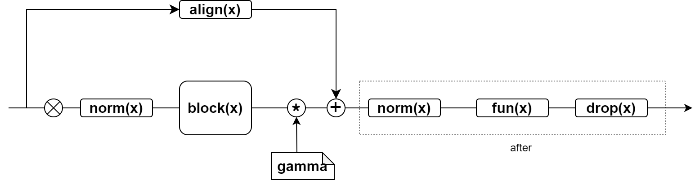
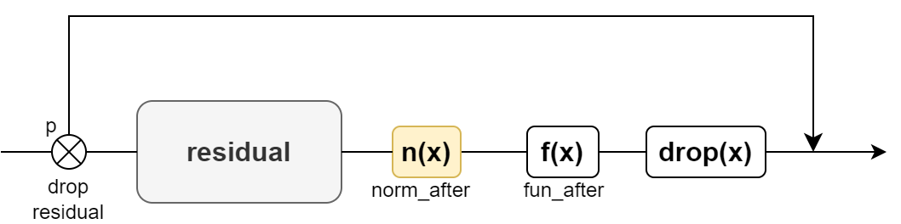
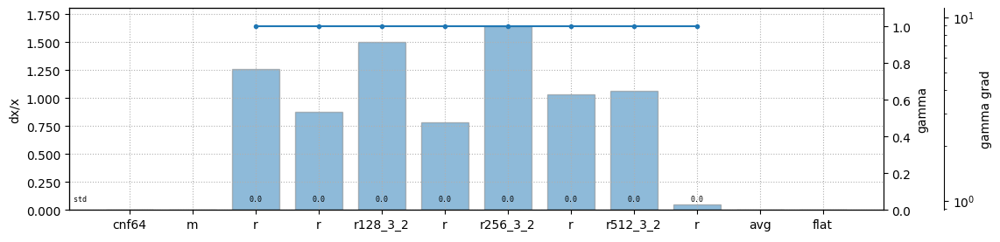
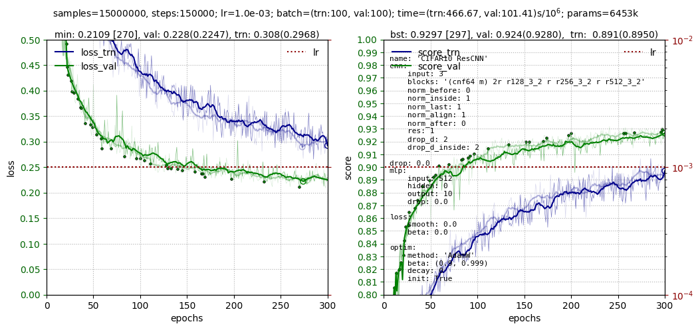
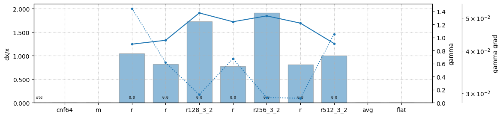

# [QuNet](README.md) - CNN

## Введение

В библиотеке  [QuNet](README.md) различные  архитетектуры с конволюционными 2d слоями создаются при помощи класса `CNN`.
Основным параметром его конструктора является строка `blocks`. 
Она состоит из разделённых пробелами "токенов" определяющих последовательность элементарных или составных слоёв сети.
Например, сеть resnet18 создаётся следующим образом:
```python
cnn = CNN(input=3, blocks="(c64_7_2 n f  m3_2) 2r r128_3_2 r r256_3_2 r r512_3_2 r")
```
В круглых скобках (которые играют  роль группировки слоёв в Sequential) находится последовательность элементарных слоёв:
* `c64_7_2` - конволюция `Conv2d` в 64 канала с ядром 7 и шагом 2. 
* `n` - нормализационный слой, равный по умолчанию  `BatchNorm2d`.
* `f` - активационная функция  (по умолчанию это `relu`).
* `m3_2` - `MaxPool2d` с ядром 3 и шагом 2.

Затем идут составные блоки.

Токен `2r` означает последовательность двух одинаковых residual блоков `r`.
Каждый из них содержит по два конволюционных слоя с нормировкой и нелинейностью между ними. Они окружены петлёй skip-connection (см. ниже). 
Такие блоки не меняют размерность тензора.

Токен `r128_3_2` также является residual блоком. Первый его конволюционный слой увеличивает число каналов до 128 и благодаря шагу (stride=2) уменьшает в 2 раза высоту H и ширину W входного тензора `(B,C,H,W)`. 
Второй конволюционный слой блока также имеет 128 выходных каналов, ядро 3 и уже единичный страйд. 
Так как размерность тензора меняется: `(B,64,H,W) -> (B,128,H/2,W/2)`, то петля skip-connection содержит  конволюционный слой `Conv2d(64,128,1)`, который выравнивает размерности входного и входного тензоров.

Аналогичный смысл имеют остальные токены строки.  
Параметр `input` задаёт число входных каналов изображения (3 RGB канала).

Полная модель, решающая задачу классификации на основе архитектуры resnet18, должна дополнительно содержать классификатор, например линейный слой:
```python
m = nn.Sequential(
    CNN(input=3, pool=1, flat=True,
        blocks="(cnf64_7_2  m3_2) 2r r128_3_2 r r256_3_2 r r512_3_2 r"),    
    nn.Linear(512, 10) )
```
Параметр `pool=1` означает добавление после blocks слоя  `AdaptiveAvgPool2d(1)`,
а параметр `flat=True` добавление `Flatten()`. 
На самом деле их указывать не обязательно, т.к. их значение по умолчанию равно `True`.
Токен `cnf` это сокращение для последовательности `c n f`.

<hr>

## Элементарные слои

Главный элементарный токен, это токен конволюционного слоя `c[channels]_[kernel]_[stride]_[padding]`.
По умолчанию число выходных каналов `channels` равно числу входных каналов, ядро `kernel=3` и шаг `stride=1`.
Если `padding` не задан (так обычно будет для resnet-овских архитектур), то он принимается равным `padding = (kernel - 1) // 2`. Таким образом:
```
c64      - Conv2d(..., 64, kernel_size=3, stride=1, padding=1)
c64_5    - Conv2d(..., 64, kernel_size=5, stride=1, padding=2)
c64_7_2  - Conv2d(..., 64, kernel_size=7, stride=2, padding=3)
```
Обратим внимание, что если `kernel=3`, а `stride=2`, то для однозначности нужно указать оба параметра: `c64_3_2` (хотя по умолчанию `kernel=3`).

Токен нормировки слоя это  символ `n` или `n1`, `n2`, `n3`, где число означает тип нормировочного слоя (см. ниже раздел "Нормализация").

Токен  `f` - функция активации (по умолчанию это `relu`, см раздел ниже "Активационная функция").

Ещё два токена `m` и `a` создают слои `MaxPool2d` и `AvgPool2d` соответственно. 
Они имеют параметры `m[kernel]_[stride]_[padding]`, со значениями по умолчанию:
`kernel=2`, `stride=2`, `padding=0`. 
Поэтому одиночный символ `m` уменьшит размеры изображения в два раза.

Пару пробелов можно сэкономить при помощи токена `cnf`, который означает последовательность трёх слоёв `"c n f"`, где, идущие после него параметры относятся к конволюционному слою.

Токен `d` - означает слой Dropout. По умолчанию это `Dropout2d`, что определяется аргументом консруктора `drop=2`. 
В конкретном месте можно изменить размерность дропаута, поставив `d1` для `Dropout`  и `d2` для `Dropout2d`.
Вероятность дропаута при его создании всегда равна 0. (т.е. слои есть, но они отключены).
Чтобы  активировать дропаут, необходимо подключить класс `Change` и, после создания модели, вызвать его статический метод `dropout`.
Первым параметром ему передаётся модель (или её часть), а вторым  - значение вероятности `p`.
Если это число, то для всех слоёв `DropoutXd` будет задано это значение. 
Можно также передать массив вещественных чисел по числу слоёв `DropoutXd`.
Если этот массив короче, чем число слоёв, будет повторяться последнее значение в массиве.

Ниже идут параметры конструктора, влияющие на элементарные слои (приведены их значения по умолчанию):

```python
bias   = False,         # создавать ли слои Conv2d со смещением
norm   = 1,             # тип нормировки для токенов 'n' (BatchNorm2d)
drop   = 2,             # размерность Dropout для токенов `d`  (Dropout2d)
fun    = 'relu',        # активационная функция для токена `f`
```

Пример:
```python
from qunet import Config, CNN, Change, ModelState

cfg = Config(
    input=1,                        # число каналов на входе
    fun = 'gelu',                   # меняем активацию с relu на gelu
    blocks="cnf32 m d cnf64 m d")   # определяем архитектуру

m = CNN(cfg)                        # создаём модель по конфигу cfg
Change.dropout(m, [0.1, 0.2])       # устанавливаем значения дропаутов

s = ModelState(m)
s.layers(2, input_size=(1,1,28,28) )
```
Класс `ModelState` выдаст следующую структуру сети (естественно всегда рекомендуется её просматривать перед началом обучения):
```python
CNN:  (1, 1, 28, 28) -> (1, 64)                           
CNN                                       params          input -> output shapes            
├─ ModuleList                                                            
│  └─ Sequential                                          (1, 1, 28, 28)  -> (1, 32, 28, 28)
│     └─ Conv2d(1->32, k:3, s:1, p:1, F)     288  ~  2% | (1, 1, 28, 28)  -> (1, 32, 28, 28)
│     └─ BatchNorm2d(32)                      64        | (1, 32, 28, 28) -> (1, 32, 28, 28)
│     └─ GELU                                             (1, 32, 28, 28) -> (1, 32, 28, 28)
│  └─ MaxPool2d(k:2, s:2, p:0)                            (1, 32, 28, 28) -> (1, 32, 14, 14)
│  └─ Dropout2d(0.1)                                      (1, 32, 14, 14) -> (1, 32, 14, 14)
│  └─ Sequential                                          (1, 32, 14, 14) -> (1, 64, 14, 14)
│     └─ Conv2d(32->64, k:3, s:1, p:1, F) 18,432  ~ 97% | (1, 32, 14, 14) -> (1, 64, 14, 14)
│     └─ BatchNorm2d(64)                     128  ~  1% | (1, 64, 14, 14) -> (1, 64, 14, 14)
│     └─ GELU                                             (1, 64, 14, 14) -> (1, 64, 14, 14)
│  └─ MaxPool2d(k:2, s:2, p:0)                            (1, 64, 14, 14) -> (1, 64, 7, 7)  
│  └─ Dropout2d(0.2)                                      (1, 64, 7, 7)   -> (1, 64, 7, 7)  
│  └─ AdaptiveAvgPool2d(1)                                (1, 64, 7, 7)   -> (1, 64, 1, 1)  
│  └─ Flatten                                             (1, 64, 1, 1)   -> (1, 64)        
```

Если `ModelState` вылетает при выводе слоёв layers, стоит его запустить без параметра `input_size`.
Например, возможно указано неверное число входных каналов `input` или размер входного изображения меньше, 
чем число понижающих размер изображения блоков. Ну и наконец, никто не отменял старого доброго `print(m)`.
<hr>

## Residual Block

Токен `r` или `r[channels]_[kernel]_[stride]` создаёт блок с петлёй обхода (skip-connection).
Случай когда блок не меняет формы тензора приведен ниже слева. 
Если форма тензора меняется, необходимо его выравнять на петле skip-connection, при помощи модуля `align(x)` (правый рисунок):

<center>
 
</center>

Центральным преобразователем входного тензора является модуль `block(x)`. 
Он состоит из двух конволюционных слоёв с нормировкой и нелинейностью между ними.
Когда stride отличен от единицы, то возможны два варианта. 
Если параметр  `stride_first=True` (по умолчанию), то в первом слое стоит `stride > 1`, а во втором `stride=1`.
Если же `stride_first=False`,  то наоборот:

```python
                                   block(x):
Conv2d(...,    channels,  kern, stride) |  Conv2d(...,     channels, kern,  1)
Norm(channels)                          |  Norm(channels)                  <- norm_inside
ReLU()                                  |  ReLU()
Conv2d(channels,channels, kern, 1)      |  Conv2d(channels, channels, kern, stride)

Norm(channels)                          |  Norm(channels)                  <- norm_block
```

В обоих случаях размер изображения уменьшается в 2 раза. 
Вариант по умолчанию принят в resnetXX архитектурах.
При одинаковом числе каналов, `stride_first=True`  работает быстрее (изображение сразу уменьшается), но может оказаться менее эффективным (второе преобразование проводится над меньшим тензором).
Тип нормировки, определяется параметром `norm_inside=1`, а функция активации параметром `fun_inside="relu"`.

```python
stride_first  = True,   # делать stride>1 на первом Conv2d, иначе на последнем
drop_inside   = 0,      # тип слоя Dropout между Conv2d 
fun_inside    = 'relu', # активационная функция для блока 'r'
```

В простейшем случае (`r` без параметров) размерности тензора на входе и на выходе совпадают (не меняется, ни число каналов, ни размер изображения). 
Такой блок окружается простой петлёй `align(x) = x`.

Если размерности тензора на входе и на выходе не совпадают (`channels` отлично от числа входных каналов  или `stride > 1`),
то петля `align(x)` является конволюционным слоём, который выравнивает размерности. Если `norm_align = 1` (по умолчанию), после конволюции стоит нормировка BatchNorm2d (если `norm_align=1`):
```
Con2d(...,  channels, kern, stride)
Norm(channels)                        <- norm_align
```

Наличие и  порядок выполнения нормировок определяется следующими настройками:
```python
norm_before   = 0,      # тип нормировки перед блоком block(x)
norm_inside   = 1,      # тип нормировки в блоке block(x) между Conv2d
norm_block    = 1,      # тип нормировки после блока block(x)
norm_align    = 1,      # тип нормировки восле блока align(x)
```

После прохождения тензора через `block(x)` он может умножаться на множитель `scale`.
Его свойства  определяются параметром `mult`. Если  `mult=0` то умножения нет (по умолчанию).
При `mult=1` - множитель scale является обучаемым скалярным параметром и при `mult=2` - обучаемым вектором  размерности `channels`.
```python            
mult          = 0,      # тип scale (0-нет, 1-обучаемый скаляр, 2-обучаемый вектор)
scale         = 1.,     # начальное значение scale (для mult > 1)
```

На самом деле, если установлено `norm_block > 0`, то делать `mult=2` особого смысла нет, так как в нормировочном слое обучаемое масштабирование каждого канала уже стоит. 
Надо ли при этом делать единое для всех каналов (скалярное) масштабирование (`mult=1`) зависит от задачи.

После вычисления `align(x) + scale * block(x)` может стоять нормировка, функция активации и дропаут:

<center>
 
</center>

Их наличие определяется следующими настройками:
```python
norm_after    = 0,      # добавлять нормировку после блоков ('r')
fun_after     = "",     # добавлять активационную функцию после блоков ('r')
drop_after    = 2,      # тип Dropout после блоков ('r')
```

Сам по себе блок `block(x)` (без петли) можно добавить при помощи токена `b`.

У всех блоков с тождественным выравниванием `align(x)=x` есть параметр `p`.
Аналогично Dropout - это вероятность исключения блока при прохождении через сеть тензора.
Подобная регуляризация может повысить качество обучения.
Как и в случае с Dropout, по умолчанию вероятности `p` равны нулю.
Чтобы их задать, необходимо после создания модели выполнить что-то типа:

```python
Change.drop_block(model, p=0.1)         # все вероятности в 0.1
Change.drop_block(model, p=[0.1, 0.2])  # первого блока в 0.1, второго и далее в 0.2
```

<hr>

## Нормализация

Нормализационный слой на входе получает тензор `x = (B,C,H,W)` и возвращает его 
в нормализованном  виде, вычитая из него среднее и деля на стандартного отклонение:
```python
x = ( (x-x.mean(dims))/x.std(dims) ) * alpha + beta
```
где `alpha`, `beta` обучаемые векторы размерности `C`, т.е. слой имеет `2*C` параметров требующих градиента (в начале обучения `alpha=1`, `beta=0`).
Во всех случаях `alpha, beta` имеют форму `(1,C,1,1)`, а при вычислении средних стоит флаг `keepdims=True`.
Размерности `dims` по которым происходит усреднение, зависят от типа номализационного слоя (параметр `norm`):

* `norm = 1` - nn.**BatchNorm2d**(C) - среднее по батчу (`dims=B`). Такая нормировка  вычисляет средние значения яркости каждого пикселя по всем примерам батча в каждом канале независимо.  Дополнительно этот слой сохраняет скользящие средние mean и std, которые затем используются в режиме `eval` даже если в батче один пример.
* `norm = 2` - **LayerNormChannels**(C) - среднее по каналам (`dims=C`). Эта нормировка рассматривает индекс `C` как индекс вектора признаков (каким он и является в конечном итоге). Среднее значение этого вектора делается нулевым, а std - единичным. Затем обучаемые константы его изменяют различным образом для каждой компоненты вектора.
* `norm = 3` - nn.**InstanceNorm2d**(C) - среднее по изображению (`dims=H,W`). В этом случае для каждого примера и канала усредняются яроксти всех пикселей. Нормированные изображения поправляются константами `alpha` и `beta` имеющих уникальные значения для каждого канала (но общие для всех пикселей и примеров)

Для всех токенов `n` используется один и тот же нормализационный слой, определяемый параметром `norm=1`.
После буквы `n` можно поставить номер нормализатора. В этом случае он изменится от значения по умолчанию.
```python
"c32 n"  # после конволюции будет нормализационный слой norm
"c32 n2" # после конволюции будет LayerNormChannels, независимо от значения norm
```

<hr>

## Активационная функция

Кроме токена `f`,  в конкретном месте можно использовать активационную функцию в виде токена, принимающего одно из  следующих значений:
```python
relu, gelu, relu6, sigmoid, tanh, swish, hswish, hsigmoid
```
Как и в случае нормализции, функция для токена `f` задается единым параметром `fun="relu"`.
Однако, при желании, её можно указать явным образом со значением отличным от значения по умолчанию:
```python
"r n f"     # на место f будет поставлена активационная функция из fun
"r n gelu"  # независимо от fun тут будет использоваться функция GELU
```

Внутри residual блоков (и после них) могут стоять функции активации, отличные от `f`:
```python
fun         = 'relu', # активационная функция для токена `f`
fun_inside  = 'relu', # активационная функция для блоков ('r')
fun_after   = "",     # добавлять активационную функцию после блоков ('r')
```

<hr>

## Визуализация

Класс `ModelState` для визуализации глубоких  архитектур не всегда удобен, т.к. они содержат большое число  параметров. Поэтому имеет смысл дополнительно запускать собственную визуализацию CNN. Для этого необходимо перевести модель в режим отладки (`debug`).
В этом режиме вычисляются абсолютные средние значения тензора на skip-connetion и аналогичное значение тензора после  `block(x)`.
Их отношения `scale*block(x) / align(x)` для каждого блока показывается на графике в как бары. 
Чем это отношение больше, тем "активнее" работает преобразователь `block(x)`. 
Если же он "отстаёт в обучении", то сети выгоднее "загнать" его выход в ноль, чтобы он "не мешал" входным фичам, идущим по skip-connection
(т.е. блок фактически не работает).

```python
state = ModelState(model)
model.cnn.debug(True)

trainer.fit(epochs=300, states=[model.cnn,  state], period_state=10, period_plot=10)
```

Рассмотрим в качестве примера `resnet18 = (cnf64 m) 2r r128_3_2 r r256_3_2 r r512_3_2 r`, адаптированную под датасет CIFAR10. После 300 эпох с lr=1e-3 и batch_size=100, валиационная точночность достигает значения 0.932. 
График "обученности" блоков имеет вид:

<center>

</center>

Видно, что последний блок `r` не добавляет к признакам новой информации  (причина этого обсуждается в последнем разделе). 
Устранение последнего блока уменьшает число параметров на 42% (с 11,117k до 6,453k). 
Время обучение (trn) на 1e6 примеров снижается на 20% (с 553 до 442)s.
При этом кривая обучения, оказывается лишь чуть ниже исходной (которая на графике приведена полупрозрачной линией):

<center>

</center>

Если при создании сети, положить `res=2,  scale=1.` (обучаемый множитель `align(x) + scale * block(x)`), то на графике визуализации сплошной линией отражается значение `scale` для каждого блока, а пунктиром - модуль градиента по `scale`:

<center>

</center>

<hr>

## Варианты CNN-архитектуры

При построении CNN-архитектуры исходными параметрами являются форма входного тензора и желаемое число признаков на выходе сети (число каналов в последем слое `AdaptiveAvgPool2d`).
Ширина и высота финального тезора (перед `AdaptiveAvgPool2d`) не должна быть слишком большой или слишком маленькой (типа 1x1). 
В первом случае признаки могут слишком фокусироваться на мелких деталях. 
Во втором - вычисления последних конволюционных блоков не эффективно. 
Например, если на вход конволюции с ядром 3 и паддингом 1 поступает тензор `(512,2,2)`, то в каждом "пикселе" при вычислении участвуют все 4 значимых пикселя и 5 нулей паддинга. 
Поэтому имеет смысл раньше вызвать `AdaptiveAvgPool2d` и использовать скрытые слои классификатора для более глубокой переработки признаков.

Даже хорошо спроектированные архитектуры часто необходимо адаптировать под конкретную задачу. 
Например, к CIFAR10 с изображениями `(3,32,32)` сеть resnet18 не подходит, т.к  в её первом модуле происходит уменьшение изображения в 4 раза: `(cnf64_7_2 m3_2)` - сначала конволюция с ядром 7 и страйдом 2, затем MaxPooling с ядром 3. 
Такая архитектура приведёт к ошибке (размер изображения станет меньше чем 1x1). 
Для этой задачи целесообразно изменить начало сети, например, на `(cnf64 m)`.

В residual архитектуре важную роль играет наличие и  порядок выполнения нормировок.
Например, в блоке с нетривиальным `align(x)` должен быть `norm(x)` и на выходе `align`, и на выходе `block(x)` (т.е. `norm_align == norm_block > 0`),
чтобы оба слагаемых в сумме `align(x) + block(x)` имели одинаковое (нулевое) среднее. Не выполнение этого условия может привести к потере 1-2% точности и балансировке dx/x на столбиках визуализации.

Ключевое действие в CNN архитектуре - это увеличение числа каналов и уменьшение ширины и высоты тензора.
В качестве примера будем считать, что текущее число каналов равно 32 и мы хотим уменьшить объем тезора `(32, H, W)` в два раза, получив `(64, H/2, W/2)`. 
Возможны следующие варианы как это можно сделать при  помощи res-блоков. 

* `"r64_3_2",  stride_first=True` - это типичный для resnetXX способ уменьшения размера при помощи страйда в первой конволюции. Этот способ наиболее экономный (первый слой формирует уменьшенный тензор и второй слой его преобразует).
* `"r64_3_2",  stride_first=False` - в этом случае уменьшение объёма произойдёт после второго слоя, тогда как первый его объём в 2 раза увеличит (число каналов).
* `"r64 m"` - самый затратный, но эффективный способ преобразования при котором сначала увеличивается число каналов, происходит их обработка во втором слое, а уменьшение размеров осуществляется при помощи MaxPooling.

Какой из этих способов окажется лучше, конечно, вопрос экспериментальный. 
Ниже приведен график кривой обучения для третьего варианта, похожего по числу каналов на resnet18: 
```
r64 m r r128 m r r256 m r r512 m
``` 
При том что он содержит почти в 2 раза меньше параметров, чем адаптированный для CIFAR10 resnet18, эта модель  опережает resnet18 (полупрозрачные линии) на более чем 2%. 
Хотя это и происходит за счёт увеличения времени тренировки на 20% (при том же числе параметров).

<center>

</center>

При большом датасете или сильной агументации, для архитектур с residual blocks, чем больше параметров, тем лучше.
Ниже приведены валидационные точности и время тренировки на 1e6 примеров для  трёх одинаковых архитектур после 300 эпох:
```
acc        time      pars      blocks
0.9305     295s     1,608k     r32  m r r64  m r r128 m r r256  m
0.9461     512s     6,417k     r64  m r r128 m r r256 m r r512  m
0.9648   1,292s    25,632k     r128 m r r256 m r r512 m r r1024 m
```

Полезной эвристикой является анализ издержек вычислений на каждом блоке и изменение объёма тензора на его выходе по сравнению с исходным тензором (для CIFAR10 `V0=3*32*32`):
```
               (cnf64 m)      2r  r128_3_2     r  r256_3_2      r  r512_3_2     r
----------------------------------------------------------------------------------            
pars 11,165           2     2*74       230   295      919   1,180   3,672   4,720
ops     140         1.8     2*19        15    19       15      19      15      19
w        32          16       16         8     8        4       4       2       2
V0/V    1.5         0.2      0.2       0.4   0.4      0.8     0.8     1.5     1.5

                    r64       m       r128     m     r256       m      r512     m
----------------------------------------------------------------------------------
pars  4860           39                230            919              3672   
ops    216           40                 59             59                59
w       32           32      16         16     8        8       4         4     2
V0/V   1.5         0.05     0.2        0.1   0.4      0.2     0.8       0.4   1.5
```

В этом документе для всех примеров с CIFAR10 использовались одинаковые гиперпараметры: `lr=1e-3, batch_size=100, Adam` и следующие преобразования агументации из torchvision:
```python
class Transform(Callback):
    def __init__(self):
        self.transform = transforms.Compose([    
            TrivialAugmentWide(interpolation=transforms.InterpolationMode.BILINEAR),
            RandomHorizontalFlip(),
            RandomCrop(32, padding=4),            
            RandomErasing(p=0.1),                   
            Lambda(lambda x: (x/255.0).float()),
            Normalize(mean=[0.485, 0.456, 0.406], std=[0.229, 0.224, 0.225], True)])

    def on_train_after_batch_transfer(self, trainer, model, batch, batch_id): #GPU
        batch[0] = self.transform(batch[0])
        return batch
```
