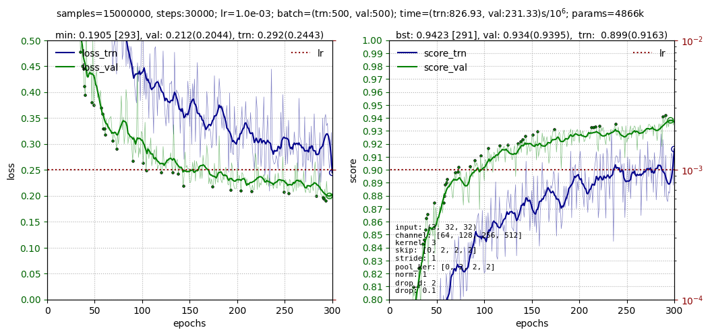

# [QuNet](README.md) - Quick start

## Before the beginning

This document is an introduction to the QuNet library.
First of all, needs to install it:

```
pip install qunet
```

Then we import the required modules from it:

```python
import torch, torch.nn as nn
import matplotlib.pyplot as plt

from qunet import  Data, MLP, Trainer, Callback
```

Let's consider a simple deep learning task using QuNet.
The code below can be found in the notebook [QuNet-Binary_classification](https://colab.research.google.com/drive/1orV9l8T7Rrqos9SZMkwvFWnur1iISZsj?usp=sharing).

<hr>

## Toy dataset

Consider a two-dimensional feature space. 
Let there be objects of two kinds (binary classification task).
Let's generate N=1200 objects.
With binary classification, target Y values must be float type and have the shape (N,1).
The output of the neural network will have the same shape.

```python
N = 1200
X = 2*torch.rand(N, 2) - 1              # [-1...1]^2
Y = torch.sum(X**2, axis=1) < 0.5       # inside or outside circle
Y = Y.float().view(-1,1)                # float and shape (N,1) for MSE or BCELoss, not (N,) !!!
```

 Draw the position  X  of objects in the feature space:

```python
fig = plt.figure(figsize=(4,4))
plt.scatter(X[:,0], X[:,1], c=Y, s=3, cmap="bwr")
plt.grid(ls=":")
plt.show()
```
The result will be something similar to this figure:
<center>

</center>

Then we use class `Data` - data loader from the `QuNet` library.
All data will be divided into training (`data_trn`) and validation (`data_val`) sets.
Training data will be shuffled before each epoch (`shuffle=True`)
```python
n_trn = int(N*0.8)
data_trn = Data( (X[:n_trn], Y[:n_trn]), batch_size=128, shuffle=True)
data_val = Data( (X[n_trn:], Y[n_trn:]), batch_size=256 )
```
Note that the   constructor of class `Data` is passed a tuple (or list) of the data needed for training. In our case, it is `(X, Y)`. In the same sequence, these data will be present in each batch. The batch size `batch_size` can be changed later by simply assigning `data_trn.batch_size = 64`.

<hr>

## Create Model

To work with the trainer, the model must be the successor of nn.Module.
In the constructor, we will create a fully connected neural network with two inputs, one output, and one hidden layer with 16 neurons.
To do this, we will use the `MLP` module (Multilayer Perceptron) of the `QuData` library.

```python
class Model(nn.Module):
    def __init__(self):              
        super().__init__() 
        self.mlp  = MLP(input=2, hidden=[16], output=1,  drop=0.1)
        self.loss = nn.BCELoss()

    def forward(self, x):                                 # (B,2)
        x = self.mlp(x)
        return torch.sigmoid(x)                           # (B,1)

    def training_step(self, batch, batch_id):        
        """ Called by the trainer during training and validation """
        x, y_true = batch                                 # (B,2) (B,1)
        y_pred = self(x)                                  # (B,1)  forward function

        loss  = self.loss(y_pred, y_true)                 # loss for optimization (scalar)!  

        y_pred = (y_pred.detach() > 0.5)                  # predicted class (0 or 1)
        acc = (y_pred == y_true.bool()).float().mean()    # accuracy        

        return {'loss': loss, 'score': acc}               # if no score, you can return loss

model = Model()
```

In addition to forward, you should additionally define some methods that the trainer uses. 
At a minimum, this should be the `training_step` function.
It accepts a batch of examples as input, consisting of a pair of `x` (model input) and `y_true` (target or true value = 0 or 1).
The output  of fuction should be a dictionary containing an 'loss' (it will be minimized). If desired, you can return 'score' with various quality indicators of the model (below, there is only one such indicator - accuracy).

<hr>

## Trainer

The Trainer is given the model, training and validation data.
Using the `set_optimizer` function, the optimizer is set.
After that, the `fit` function  is called:
```python
trainer = Trainer(model, data_trn, data_val)

trainer.set_optimizer( torch.optim.Adam(model.parameters(), lr=1e-3, weight_decay=1e-4) )
trainer.fit(epochs=500, period_plot=100)
```
You can add different training schedulers, customize the output of training graphs, manage the storage of the best models and checkpoints, and much more. 
In particular, the parameter `period_plot = 100` means that every 100 epochs the training plot will be displayed:

<center>

</center>

The points on this plot are the last top 100 local validation metrics and loss.
The number in square brackets is the epoch at which the best score (on the left plot) and loss (on the right plot) were obtained.

<hr>

## Callback

Let's draw the class-separating surface that the model builds in the learning process.
To do this, let's create the  `Visual` class - the successor of the `Callback` class.
This class has [many methods](https://github.com/steps137/qunet/blob/master/qunet/callback.py) that are called when certain events occur.
Below we will override the `on_after_plot` method, which is called after the training plots have been rendered.
In this method, we will draw the corresponding surface:

```python
class Visual(Callback):
    def on_after_plot(self, trainer, model):
        """ Called after training plot. """        
        h, w = 64, 64
        x = torch.cartesian_prod(torch.linspace(-1,1,h), torch.linspace(-1,1,w)) 
        model.train(False)
        with torch.no_grad():
            y = model(x).view(h,w)

        fig = plt.figure(figsize=(4,4))
        plt.imshow(y, cmap="bwr", origin='lower', extent=[-1,1,-1,1], alpha=0.5)
        plt.scatter(X[:,0], X[:,1], c=Y, s=3, cmap="bwr")
        plt.show()            
```

In order for the callback to be called, it must be placed in the `callbacks` list of the trainer (this can also be done when creating it):
```python
trainer.callbacks=[ Visual() ]
trainer.set_optimizer( torch.optim.Adam(model.parameters(), lr=1e-3, weight_decay=1e-4) )
trainer.fit(500, period_plot=100)
```
As a result, images similar to this will be displayed:
<center>

</center>

<hr>

## Using Schedules

Schedulers allow you to control the learning process by changing the learning rate according to the required algorithm.
There can be one or more schedulers. In the latter case, they are processed sequentially one after another.

Above, when the `Adam` optimizer was added, it was given a fixed learning rate of `lr=1e-3`.
We will dynamically change it in the learning process. 
To do this, before calling the `fit` function, create a scheduler and add it to the trainer:

```python
trainer.set_scheduler( Scheduler_Cos(lr1=1e-4, lr_hot=1e-2, lr2=1e-3, epochs=200, warmup=50) )
trainer.fit(500, period_plot=100)
```

Now the learning rate starts at `lr1=1e-4`.
During `warmup` epochs, it "warms up" linearly to the value `lr_hot=1e-2`.
Then during `epochs` it decreases to the value `lr2=1e-3` according to the "cosine law".

You can use a sequence of multiple schedulers.
More like this is described in [here](schedules.md).
Example of learning curves of various schedulers:


<hr>

## Best Model and Checkpoints

Trainer can store the best models in memory or on disk.
Small models are convenient to keep in memory. 
When the best validation loss or score is reached, a copy of the model is made. 
To do this, you need to enable `train.best.copy` and specify the target value for which you want to remember the model in the `monitor` list:
```python
trainer.best(copy=True)
trainer.fit(epochs=200, monitor=['score'])
```
The last best model will be in  `trainer.best.score_model` or `trainer.best.loss_model`.
The values of the corresponding metrics are in `trainer.best.loss` and `trainer.best.score`.
These models can be used to roll back if something went wrong:
```python
trainer.model = copy.deepcopy(trainer.best.score_model)   
```
You can also save the best model to disk yourself:
```python
trainer.save("best_score.pt", trainer.best.score_model)
```

To automatically save the best models by loss and/or score on disk, you need to set folders.
Saving will occur if you specify `monitor` in `fit`:
```python
trainer.folders(loss='log/loss', score='log/score',  point='log/checkpoints', prefix="01")
trainer.fit(epochs=200, monitor=['score', 'loss', 'point'], period_point=50)
```
The best model by score and loss will be saved each time a new best value is reached.
Checkpoints (`point`) are simply saving the current state of the model.
They can be done with the desired periodicity in epochs (period_point=1 by default).
The `prefix` string will be prepended to the name of each file.
For example, it could be the number of the experiment with the given hyperparameters.

The best score is the metric of the first element in the score.
If `trainer.score_max=True`, then the higher the score, the better (for example, accuracy).

<hr>

