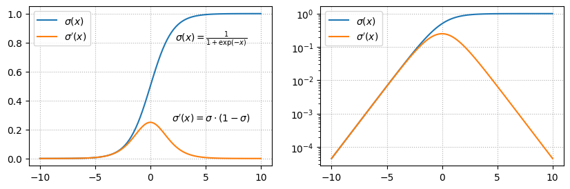

# QuNet - Tasks of the week

| * [Linear Regression](#linear-regression) | * [Tensor contraction](#tensor-contraction) | * [Logit](#logit) | * [Logsigmoid](#logsigmoid) | 
| ---- | ---  | ---  | ---  |


## Linear Regression
Modeling linear regression $y=x_1+x_2$ with MSE-loss:
```python
# dataset:
X = torch.rand(100,2)
Y = X.sum(dim=1) 

# model:
model = nn.Linear(2,1, bias=False)

Y_pred = model(X)
loss = (Y_pred-Y).pow(2).mean()
```
Where is the mistake made and why does it lead to an incorrect result?

<details>

<b>Little hint</b>:

```python
model = nn.Linear(2,1, bias=False)
model.weight.data=torch.ones(1,2)

Y_pred = model(X)
loss = (Y_pred-Y).pow(2).mean()

print(loss.detach()) # ?????
```
</details>

<details>
<b>Answer</b>:
We need to change the shape of the target in the training data:

```python
Y = X.sum(dim=1).view(-1,1)      # (B,1)
# or
Y = X.sum(dim=1, keepdims=True)  # (B,1)
```

<b>Explanation</b> :
Input matrix shape `X.shape=(100, 2)`.
The line layer (2,1) produces `Y_pred.shape=(100,1)` as output.
We compare it with `Y.shape=(100,)`.
In pytorch, if the shape of the tensors does not match, a broadcasting procedure is done in which the dimension is added in front. When subtracting, we get:

```python
(100,)-(100,1) -> (1,100)-(100,1)  -> (100,100)-(100,100) 
```

<b>For example</b> :
```python
Y1 = torch.tensor([1, 2])         # (2,)
Y2 = torch.tensor([[1], [2]])     # (2,1)
Y1 - Y2 = 
tensor([[ 0,  1],
        [-1,  0]])
```
</details>

<hr>

## Tensor contraction

Глубокое обучение - это преобразования тензоров. Свёртка (основное преобразование) равна сумме по некоторым индексам произведений компонент тензоров. Например:

```python
X = torch.rand(2,3,4)
Y = torch.rand(4,5)
Z = X @ Y             # (2,3,5):  Z[a,b,c] - это сумма по i в X[a,b,i] * Y[i,c]
```

Необходимо предложить максимальное число способов (без циклов!) свернуть по последнему в X и первому в Y индексу следующие 2 тензора:

```python
X = torch.rand(2,3)
Y = torch.rand(3,4,5)
Z = f(X,Y)              # (2,4,5)
```

<details>
<b>Answer</b> :

```python
# 1.
torch.einsum('ij,jkl->ikl', X, Y)
# 2.
torch.tensordot(X, Y, dims=([1],[0]) )
# 3.
( X @ Y.view(3,-1) ).view(2,4,5) 
# 4.
( X @ Y.permute(1,0,2) ).permute(1,0,2) 
```


Самая неэффективная по времени и памяти версия:

```python
Z = ( X[:,:,None,None] * Y[None,:,:,:]).sum(1)
```

Чтобы умножить тензоры, pytorch выравнивает их размерности

```python
(2,3,1,1) * (1,3,4,5) -> (2,3,4,5) * (2,3,4,5). 
```
А для этого нужно первый тензор увеличить в 4*5 раз, в второй в 2 раза,
продублировав значения по выравниваемым осям. 
Чтобы понять трагедию ситуации, припишите по 3 нолика к каждой размерности :)


</details>

<hr>

## Logit

Why do we call the output of the classification layer <b>logit</b>?

<details>

<b>Answer</b>:
Mathematicians call the logit - logarithm of the ratio of the probability of the possibility of an event to the probability of its impossibility: 
$$
\text{logit} = \log\frac{p}{1-p}.
$$ 
Therefore, the probability is equal to the sigmoid of the output of the neural network: $y=\text{logit}$
$$
p = \sigma(y) = \frac{1}{1+e^{-y}}.
$$

</details>

<hr>

## Logsigmoid

При бинарной классификации, на выходе нейронной сети обычно ставят сигмоид.
Он переводит логит с произвольным значением в интервал "вероятностей"  [0...1].

В библиотеке семантической сегментации smp, там, 
где положено быть сигмоиду: y_pred = torch.sigmoid(logit), стоит:

```python
y_pred = F.logsigmoid(logit).exp()
```

Читателю поясняют:
"_Using Log-Exp as this gives more numerically stable result_
_and does not cause vanishing gradient on extreme values 0 and 1_".

*Вопросы:*
1. Когда и почему градиент исчезает при прохождении через сигмоид? (*)
2. Когда и почему справедливо утверждение авторов? (***)

<details>

**Ответ**

1. Производная сигмоида σ(x) = 1/(1+exp(-x)) равна  σ'(x) = σ(x)*(1-σ(x)).
Так как σ(-∞)=0 и σ(∞)=1, то при больших |x| производная равна нулю.
Из этого следует необходимость борьбы с большими логитами
(при помощи weight_decay = L2 регуляризации или другими способами).
В противном случае перегретый классификационный слой и вся сеть перестанут обучаться.

<center>

</center>

2. Понятно, что математически exp( log σ(x) ) == σ(x).
Но вычислительная математика != математике бумажной.
Прежде всего, как заметили некоторые, при больших по модулю отрицательных значениях
в районе x = -89 сигмоид становится строго равным нулю:

```python
import torch, torch.nn as nn, torch.nn.functional as F

x = torch.tensor(-88.)           
print( torch.sigmoid(x)     .item() ) # 6.0546e-39
print( F.logsigmoid(x).exp().item() ) # 6.0546e-39

x = torch.tensor(-89.)           
print( torch.sigmoid(x)     .item() ) # 0.0
print( F.logsigmoid(x).exp().item() ) # 8.194e-40
```

Но проблема на самом деле начинается существенно раньше и связана с градиентом.
Вычислим его:

```python
x = torch.tensor(20.0, requires_grad=True)
y = F.logsigmoid(x).exp()
y.backward()
print(x.grad.item())
```

При отрицательных x разницы нет. При больших положительных x~20 градиент сигмоида 
в точности зануляется, тогда как Log-Exp остаётся малым, но ненулевым:
```python
x                 -20      -10        0      10         20        30        
sigmoid:          2.06e-09  4.54e-05  0.25   4.54e-05   0.0       0.0
logsigmoid.exp    2.06e-09  4.54e-05  0.25   4.54e-05   2.06e-09  9.35e-14
```

Ситуация усугубляется при использовании половинной точности
(для неё logsigmoid доступен только на GPU):

```python
x = torch.tensor(10.0, requires_grad=True, dtype=torch.float16, device='cuda')
```

```python
x                 -20    -10         0       10         15        20        
sigmoid:           0.0   4.54e-05    0.25    0.0        0.0       0.0
logsigmoid.exp     0.0   4.54e-05    0.25    4.54e-05   2.98e-07  0.0
```
Таким образом, действительно Log-Exp чуть менее быстро зануляет градиент,
для больших x, особенно при float16. 
Но в целом лучше не давать сети перегреваться. :)

</details>