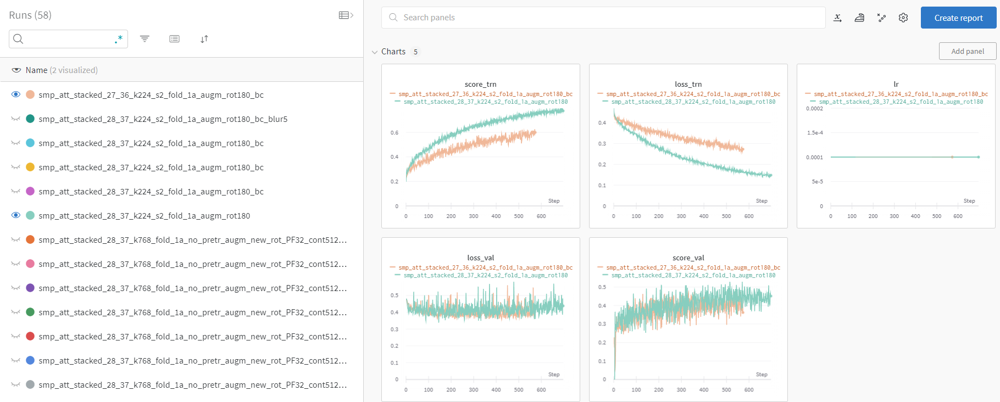

# [QuNet](README.md) - WandB intregration

Weights & Biases — это платформа машинного обучения, позволяющая разработчикам отслеживать процесс обучения моделей, сравнивать версии, эксперименты и их конфигурации. Боллее детально о возможностях платформы можно узнать по ссылке 
[docs.wandb.ai](https://docs.wandb.ai/)

Для интеграции с текущей библиотекой необходимо зайти в настройки 
[wandb settings](https://wandb.ai/settings) и в разделе `Danger Zone` скопировать `API key`

Теперь для отправки прогреса обучения необходимо передать тренеру конфигурацию
следующего вида:

```python
wandb_cfg = Config(
    project_name = 'ImageNet',     # имя проекта
    run_name     = 'vit_emb_256',  # название эксперимента
    api_key      = 'xxxxxxxxxxxx', # API key 
)

trainer = Trainer(model,
                  data_trn,
                  data_val,
                  wandb_cfg=wandb_cfg)
```

После запуска обучения с интервалом в одну эпоху метрики будут отправлятся на сервер.
Результаты можно уведить перейдя по ссылке [wandb](https://wandb.ai/home) и выбрав соостветствующий проект.

<center>

</center>

Дополнительно каждому эксперименту привязывается конфигурация соответствующей модели и передается на сервер. Это позволяет сравнивать различные эксперименты в зависимости от параметров конфигурации

<center>

</center>